## [IOS XE Programmability Lab](https://github.com/jeremycohoe/cisco-ios-xe-programmability-lab)

## **Module: Ansible**

### Topics Covered:

Ansible

Server Installation

Environment setup

Create an inventory file

Test device connectivity

Ansible Documentation

Ansible Playbooks

Build an IOS XE CLIs Playbook

Build a Playbook for IOS XE commands

Using NETCONF in Ansible

Build a Playbook for upgrade on IOS XE switches

Conclusion


## Ansible 

Ansible is an open source configuration management platform.

Configuration Management is the practice of automating software
provisioning, configuration management, and application deployment.

This practice has been widely used across IT systems management by many
organizations large and small for over a decade. Having been proven
successful with servers and applications, in recent years, it has
extended to the network as well.

With these tools you can define and enforce configuration related to
system level operations (e.g., authentication, logging, image),
interface level configuration (e.g., VLAN, QoS, Security), routing
configurations (e.g., OSPF or BGP), and much more.

Ansible is based on an "agent-less" architecture, so there is no need to
install anything onto the Cisco IOS XE device to get started.

Ansible Core modules for Cisco IOS and IOS XE devices have been
available since release 2.3 so there is no need for anything outside of
a base Ansible installation.

Both CLI-based and NETCONF-based configuration are supported. The
Ansible NETCONF implementation changed in the 2.5 release, leveraging
the newly introduced NETCONF connection instead of the usual local
connection.

In this lab we are going to use Ansible 2.5.4 release.

The picture below describes the main Ansible terminology:

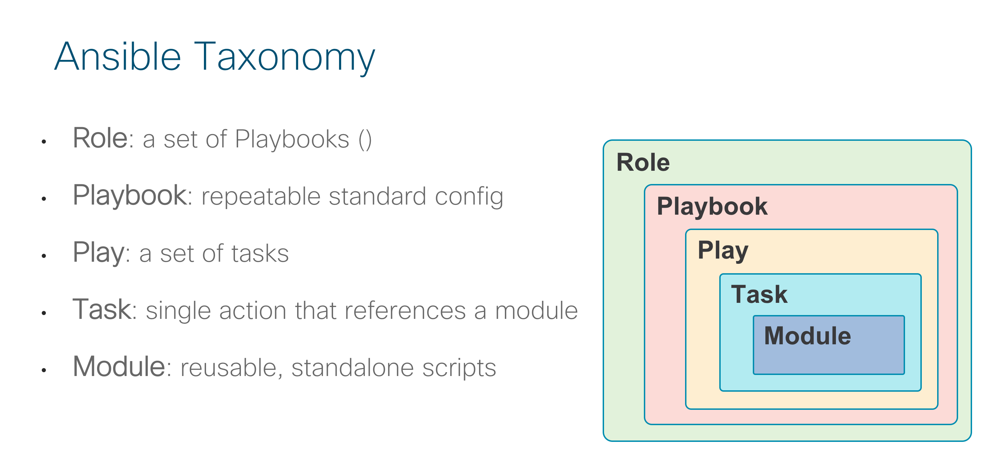

Ansible provides off-the-shelf modules to manage a variety of servers,
application and network devices. In this lab we are going to mainly use
the Ansible IOS modules.


## Server Installation

Ansible can be installed on any computer running the most popular Linux
distributions like Red Hat, CentOS, Fedora, Debian, or Ubuntu, using
either the OS package manager or via the Python package manager (pip).

For instance, you can install latest Ansible on an Ubuntu server with:

```
# sudo pip install ansible
```

In this lab there is no Internet connectivity and Ansible has been
already pre-installed in the Ubuntu Server.

All the Cisco IOS XE modules are included in Ansible Core so no
additional effort is required to begin automating your Cisco IOS XE
devices.

Step 1.  Open the Ubuntu server PuTTY session by clicking on **Ubuntu** on
    the desktop. You can verify if Ansible is installed in our lab and
    related version with:

Note: If you are using an existing PuTTY window, be sure to return to
the home directory by typing **cd** into the Ubuntu server.

```
auto@automation:~/ ansible --version
```

You should see the following:


## Environment setup

Create an Ansible configuration file

The Ansible configuration file stores the default configs used by all
Playbooks.

Step 2.  On the Windows host, open **Sublime Text 3** from the Start menu,
    create a new file and enter the following into the window:

```
[defaults]
inventory = ./hosts
host_key_checking = False
roles_path = ./
remote_user = admin
deprecation_warnings=False
```
Save the file as **z:\\ansible\\ansible.cfg**

These ensure that Ansible:

-   Uses the inventory **hosts** file in the local directory
-   Disables host checking to automatically add hosts to
    **known\_hosts** file
-   Sets the roles path to the local directory
-   Set the default user for device connections to **admin**
-   Turn off any **deprecation warnings**


## Create an inventory file

The inventory file is where the devices under management are listed.
Devices can be grouped, and a single device can be included in multiple
groups.

Step 3.  On the Windows host, open **Sublime Text 3** from the Start menu,
    create a new file and enter the following into the window:

```
[csr1000v]
10.1.1.2

[c9300]
10.1.1.5

[c9800]
10.1.1.6

[ios:children]
csr1000v
c9300
c9800

[ios:vars]
ansible_connection=network_cli
ansible_network_os=ios

[ubuntu]
10.1.1.3
```
Save the file as **z:\\ansible\\hosts**

In the above hosts file, we have three groups called **csr100v**,
**c9300** and **c9800**, with one device each. Groups can be nested like
the **ios-xe** group which includes all three groups.

The default device connection is set to **network\_cli** (that is CLIs
over SSH), and Operating System type to ios for all the device in the
**ios-xe** group, that is, for all the devices in this lab.

Defaults can be overridden in playbooks and at the command line.

We’ll see some override examples later in the lab.

## Test device connectivity

To make sure the Ansible server can reach all the devices, go to the
Ubuntu server, move to the ansible directory:

```
auto@automation:~/ cd /home/auto/python/ansible
```
and use the following Ansible command and provide the device SSH
password **admin**

```
auto@automation:~/python/ansible\$ ansible ios -m ping -u admin -k
SSH password: Cisco123
```
Where:

-   **ios-xe** is the device group
-   **ping** is the Ansible module to test device connectivity
-   **-u** is the option to provide the device SSH username
-   **-k** is the option to provide the device password at run time

You should see the following:

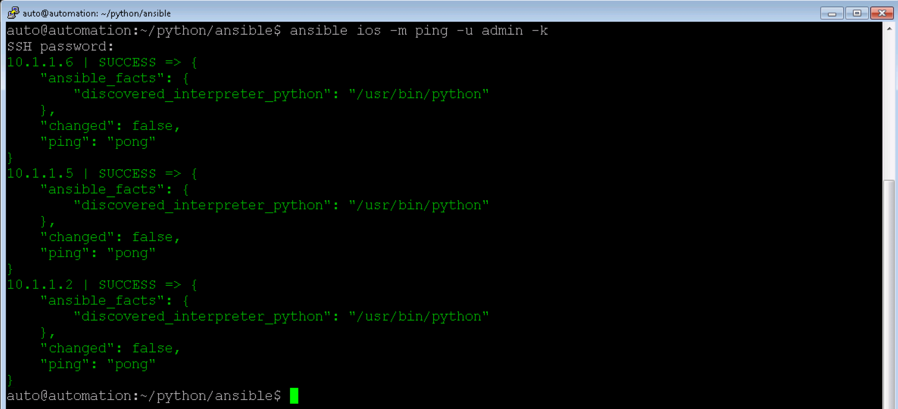

## Ansible Documentation

Thorough documentation for all Cisco IOS XE modules can be found on the
Ansible website
(<http://docs.ansible.com/ansible/latest/modules/ios_vrf_module.html>)
or alternatively from the terminal, by utilizing the inbuilt
documentation tool.

1.  Test the documentation tool with the **ios\_config** module:

```
auto@automation:~/python/ansible$ ansible-doc ios_config
```
You should see the following:

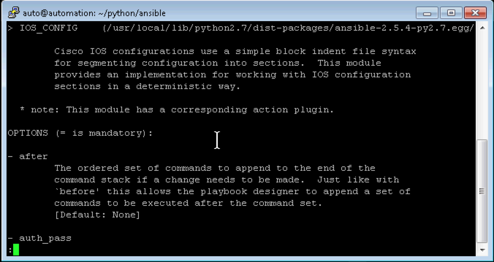

The documentation tool provides a description of the given module, all
the mandatory and optional parameters, as well as some useful examples
to start playing with the module.

Exit out of the documentation screen when finished by pressing "q".

## Ansible Playbooks

An Ansible Playbook is a repeatable standard config. Playbooks are
written in YAML, a common encoding format, which is very easy to read
and uses indentation for creating the script hierarchy. Pay extra
attention to the indentation!!!

In the next steps, you will build and execute several Ansible Playbooks

Step 5.  Write a Playbook to configure VRFs

In this initial playbook we will provision a number of VRFs across all
devices and remove (**purge**) any other VRF configured on the device.
We will use the Ansible module called **ios\_vrf** to automate this
task.

On the Windows host, open **Sublime Text 3** from the Start menu, create
a new file and enter the following into the window:

```
---

- name: configure vrfs and remove any other vrf configured
  hosts: ios
  gather_facts: no

  tasks:
    - name: configure vfrs and purge all others
      ios_vrf:
        vrfs:
            - red
            - blue
            - yellow
        purge: yes
```

**Note:** Please note carefully that the file begins with three hyphens!
(---)

Save the file as **z:\\ansible\\vrf.yaml**

Sublime will autodetect the YAML format and display the file like in the
picture below:

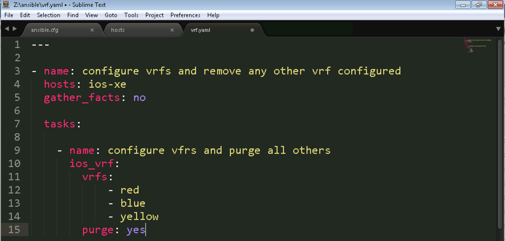

If the colors do not match those shown in the screen shot, most likely
something is wrong with the file indentation. Double check before
proceeding to the next step.

Step 6.  Let’s analyze the playbook top to bottom:

-   All the YAML files start with the triple dash characters.
-   **name**: name is assigned to the playbook “configure vrfs…”
-   **hosts**: define the group of devices, remember **ios-xe** group
    include both the cat3k and cat9k. By default, the Playbook executes
    against all the devices in the given group
-   **gather\_facts**: facts (HW and SW info) can be collected from the
    managed device. In this playbook it is disabled to speed up the
    playbook execution but you can turn it on replacing **no** with
    **yes**
-   **tasks**: there is a single task in this example and it’s named
    “configure vfrs and purge all others”
-   **ios\_vrf**: is the Ansible module provided to manage VRFs on a
    Cisco device running IOS
-   **vrfs**: is the **ios\_vrf** module option to provide the list of
    VRFs to be configured, in this case the VRFs are **red**, **blue**
    and **yellow**
-   **purge:** is the optional **ios\_vrf** module parameter. If set to
    **yes**, all VRFs other than the one listed above are removed from
    the device

By default, Ansible will use the inventory hosts file located in
**/etc/ansible/hosts**. However, a different hosts file can be specified
using the **-i** flag at runtime or defined in the **ansible.cfg** file.
We set the inventory to the local **./hosts** file in the ansible.cfg
file in previously.

Step 7.  Now run the playbook in the Ubuntu Server with the following command
    and provide the password **Cisco123**:

```
auto@automation:~/python/ansible$ ansible-playbook vrf.yaml -u admin -k
SSH password: Cisco123
```

You should see the following:

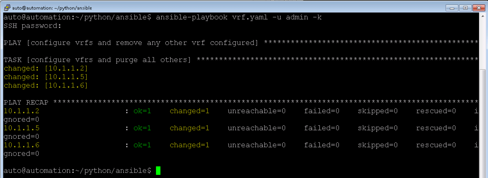

Let’s quickly analyze the output:

-   both the playbook and task name (PLAY and TASK) are shown during the
    playbook execution
-   the execution was successful (OK=1) for all the devices
-   the configuration of both devices has been changed (changed=1)

Step 8.  Now connect to one of the devices using the links in the Windows
    desktop (c9300) and verify that the VRFs have been configured.

You should see the following:

```
c9300# sh run | include vrf def
vrf definition Mgmt-vrf
vrf definition blue
vrf definition red
vrf definition yellow
```

Ansible provides many more modules to configure other IOS XE features
like VLANs, users, static routes, L2 and L3 interfaces and so on.

## Build an IOS XE CLIs Playbook

For IOS XE features not yet supported by Ansible or for configurations
based on a known list of configuration CLIs, Ansible provides a module
named **ios\_config**.

Step 9.  On the Windows host, open **Sublime Text 3** from the Start menu,
    create a new file and enter the following into the window:

```
---

- name: configure a set of IOS XE CLIs using the Ansible ios_config module 
  hosts: ios
  gather_facts: no

  tasks:

    - name: Configure ntp server
      ios_config:
        lines:
          - ntp server 171.68.38.65
          - ntp server 1.2.3.4

    - name: Configure acl
      ios_config:
        lines:
            - 10 permit ip host 1.1.1.1 any log
            - 20 permit ip host 2.2.2.2 any log
            - 30 permit ip host 3.3.3.3 any log
            - 40 permit ip host 4.4.4.4 any log
            - 50 permit ip host 5.5.5.5 any log
        parents: ip access-list extended AnsibleTest
        before: no ip access-list extended AnsibleTest
        match: exact
```

Save the file as **z:\\ansible\\config.yaml**

You should see the following:

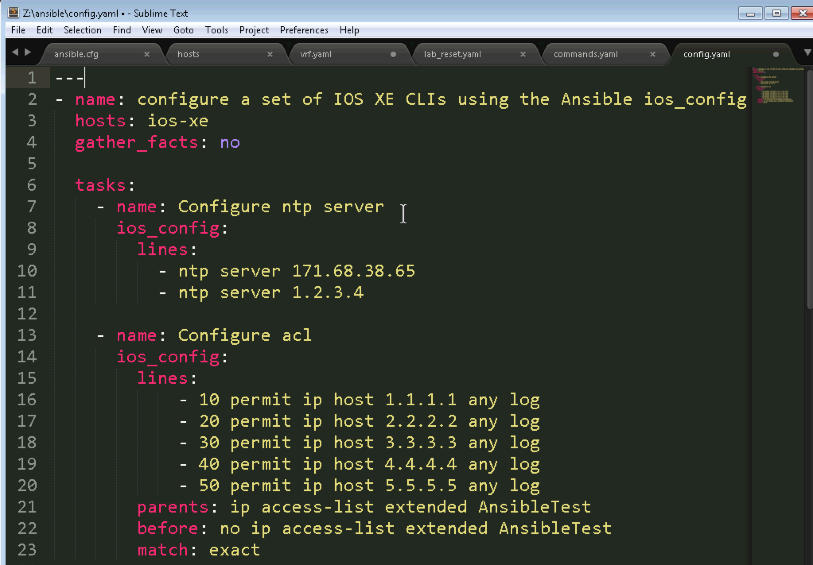

The first task configures a given list of NTP servers and the second
task an extended ACL.

Notice the single ACL entries are applied after having removed the ACL
with the option **before** and entered in the ACL config mode using the
option **parents**.

Step 10.  Return to the Ubuntu server and execute the playbook:

```
auto@automation:~/python/ansible$ ansible-playbook config.yaml -u admin -k
SSH password:  Cisco123
```

Connect to one of the devices using the link in the Windows desktop and
verify both the NTP and ACL configurations have been applied.

You should see the following output:

```
c9300# sh run | i ntp
ntp server 171.68.38.65
ntp server 1.2.3.4
c9300#
c9300# sh run | sec ip acc
ip access-list extended AnsibleTest
 permit ip host 1.1.1.1 any log
 permit ip host 2.2.2.2 any log
 permit ip host 3.3.3.3 any log
 permit ip host 4.4.4.4 any log
 permit ip host 5.5.5.5 any log
```


## Build a Playbook for IOS XE commands

In the previous step we used the module for IOS XE configuration CLIs.

What about IOS XE exec CLIs? You need to use the **ios\_command** module
instead.

Step 11.  On the Windows host, open **Sublime Text 3** from the Start menu,
    create a new file and enter the following into the window:

```
---

- name: run commands on Cisco IOS XE devices
  hosts: ios
  gather_facts: no

  tasks:
    - name: show version and ip interfaces brief
      ios_command:
        commands:
            - show version
            - show ip interface brief
```


Save the file as z:\\ansible\\commands.yaml

You should see the following:

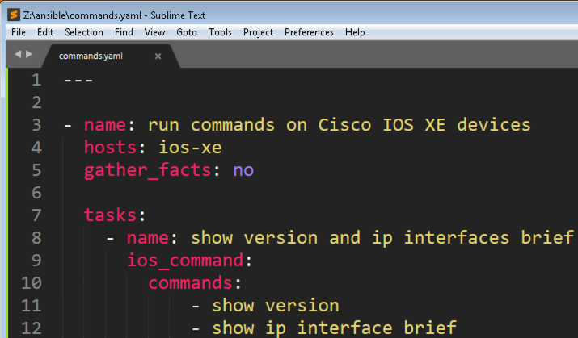

In the Playbook above we have only one task to execute two IOS XE exec
commands.

Step 12.  Now run the playbook in the Ubuntu Server with the following command
    and provide the password **Cisco123**:

```
auto@automation:~/python/ansible$ ansible-playbook commands.yaml -u admin -k
SSH password:  Cisco123
```
You should see the following:

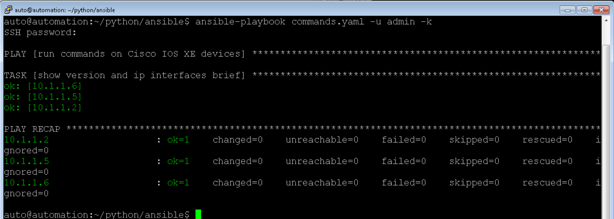

The Playbook was executed successfully (OK=1) but…where is the CLI
output???

Step 13.  Try again but this time add a **-v** option at the end.

```
auto@automation:~/python/ansible$ ansible-playbook commands.yaml -u admin -k -v
```

You should see the CLIs output like in the figure below.

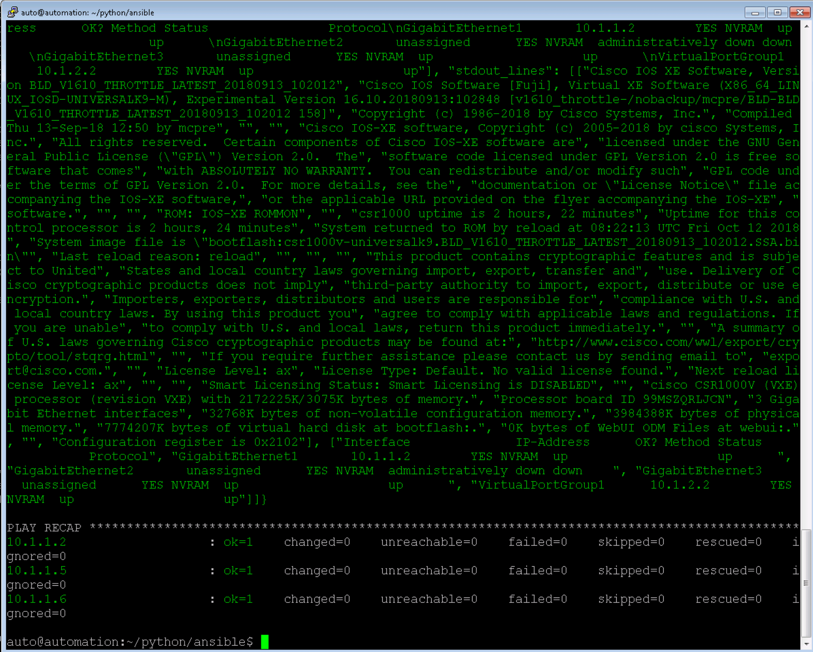

If you check the output carefully, you’ll see that the output is stored
in two variables named **stdout** and **stdout\_lines**. The first
variable stores the output in a single string and the single CLI output
lines are separated by \\n, that is, Carriage Return (Enter) characters
while the second variable is a list of strings, each storing a single
CLI output line.

The **-v** option we added in the second playbook execution is the
Ansible option to provide a more verbose output, very useful to debug
Playbooks executions and failures. The more v's you provide, the more
verbosity you get. For example, adding **-vv** will provide more verbose
output than **-v**.

Using NETCONF in Ansible
------------------------

NETCONF connection is also available in Ansible. Using “netconf-config”
module in ansible allows the user to send a configuration XML file to
a networking device and detects if there was a configuration change.

Step 1.  To configure an interface description using NETCONF, on the Windows
    host, open **Sublime Text** from the Start menu, create a new file
    and enter the following into the window:


```
---

- name: test Ansible connection netconf on Cisco IOS XE
  hosts: c9300
  vars:
      ansible_connection: netconf
      ansible_network_os: default
  gather_facts: no

  tasks:
  - name: set Management interface description
    netconf_config:
      xml: |
        <config>
          <interfaces xmlns="urn:ietf:params:xml:ns:yang:ietf-interfaces">
            <interface>
              <name>GigabitEthernet1/0/1</name>
              <description>Managed by Ansible using netconf connection</description>
            </interface>
          </interfaces>
        </config>        
```        

Save the file as **z:\\ansible\\netconf-description.yaml**

You should see the following:

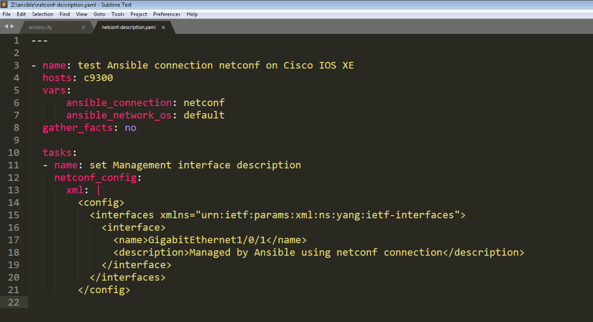

-   In this playbook we are using “**vars**” to define
    ansible\_connection and ansible\_network\_os to use locally instead
    of changing in the ansible.cfg.
-   **netconf\_config** is the module in ansible to configure on the
    network device using NETCONF connection

Step 2.  Now run the playbook in the Ubuntu Server with the following command
    and provide the password **Cisco123**:

```
auto@automation:~/python/ansible$ ansible-playbook netconf-description.yaml -u admin -k
SSH password:  Cisco123
```

Connect to c9300 in the Windows desktop and verify interface description
on gi1/0/1 have been applied.

You should see the following output:


Step 3.  To configure telemetry subscriptions using NETCONF, on the Windows
    host, open **Sublime Text** from the Start menu, create a new file
    and enter the following into the window:

```
---

- name: test Ansible connection netconf on Cisco IOS XE
  hosts: c9300
  vars:
      ansible_connection: netconf
      ansible_network_os: default
  gather_facts: no

  tasks:
  - name: establish subscription
    netconf_config:
      xml: |
          <config>
            <mdt-config-data xmlns="http://cisco.com/ns/yang/Cisco-IOS-XE-mdt-cfg">
              <mdt-subscription>
                <subscription-id>501</subscription-id>
                <base>
                  <stream>yang-push</stream>
                  <encoding>encode-kvgpb</encoding>
                  <source-address>10.1.1.5</source-address>
                  <period>1000</period>
                  <xpath>/process-cpu-ios-xe-oper:cpu-usage/cpu-utilization/five-seconds</xpath>
                </base>
                <mdt-receivers>
                  <address>10.1.1.3</address>
                  <port>57500</port>
                  <protocol>grpc-tcp</protocol>
                </mdt-receivers>
              </mdt-subscription>


              <mdt-subscription>
                <subscription-id>502</subscription-id>
                <base>
                  <stream>yang-push</stream>
                  <encoding>encode-kvgpb</encoding>
                  <source-address>10.1.1.5</source-address>
                  <period>1000</period>
                  <xpath>/if:interfaces-state/interface[name="GigabitEthernet1/0/24"]/statistics</xpath>
                </base>
                <mdt-receivers>
                  <address>10.1.1.3</address>
                  <port>57500</port>
                  <protocol>grpc-tcp</protocol>
                </mdt-receivers>
              </mdt-subscription>
            </mdt-config-data>
          </config>
```

Save the file as **z:\\ansible\\Telemetry.yaml**

You should see the following:

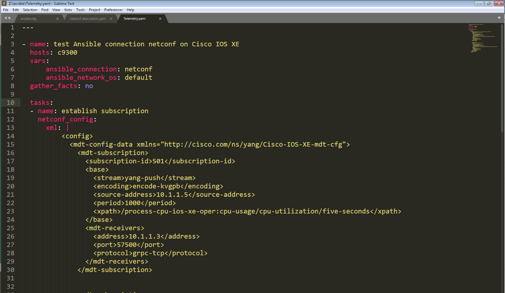

Step 4.  Now run the playbook in the Ubuntu Server with the following command
    and provide the password **Cisco123**:

```
auto@automation:~/python/ansible$ ansible-playbook Telemetry.yaml -u admin -k
SSH password:  Cisco123
```

Connect to c9300 in the Windows desktop and verify interface description
on gi1/0/1 have been applied.

You should see the following output:

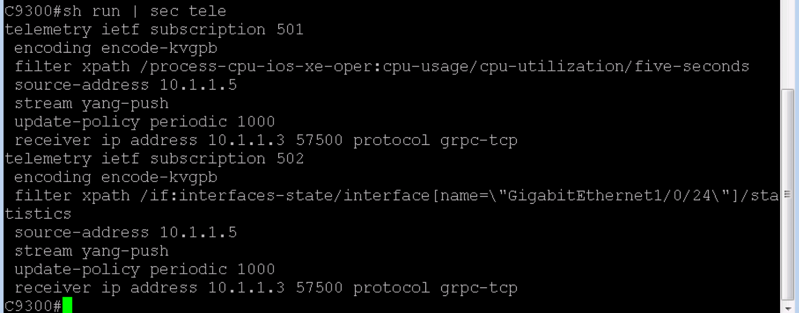

## Build a Playbook for upgrade on IOS XE switches

Step 1.  To upgrade a code on IOS XE switch and copy the code from a ubuntu VM to switch, on the Windows host, open **Sublime Text** from the Start menu, create a new file and enter the following into the window:

```
---
- name: upgrade on Cisco IOS XE switches
  hosts: c9300
  gather_facts: no
  connection: network_cli
################################################################################ #
# Step 1: Define necessary Variables and use these variable on below tasks.
# ################################################################################

  vars:
    SERVER_IP: 10.1.1.3
    SERVER_IP_USER: username
    SERVER_IP_PASS: password
    IOS_PATH: /var/www/html/
    IOS_FILE: cat9k_iosxe.17.02.01.SPA.bin
    BOOT_LOC: flash
################################################################################ #
# Step 2: Define task to copy the code from ubuntu VM to 9300
# ################################################################################

  tasks:
  - name: COPY THE CODE FROM UBUNTU VM TO 9300
    ios_command:
      commands:
        - command: 'copy http://{{ SERVER_IP}}/{{ IOS_FILE }} {{ BOOT_LOC }}:{{ IOS_FILE }}'
          check_all: False
          prompt:
            - "Destination filename [{{ IOS_FILE }}]?"
            - "Do you want to over write? [confirm]"
          answer: 
            - "\r"
            - "n"
    vars:
      ansible_command_timeout: 600
    tags:
      - COPY_CODE
################################################################################ #
# Step 3: Define task to install the code and then reload
# ################################################################################

  - name: INSTALL THE CODE AND THEN RELOAD THE SWITCH
    ios_command:
      commands:
        - wr mem
        - install add file {{ BOOT_LOC }}:{{ IOS_FILE }} activate commit prompt-level none
    vars:
      ansible_command_timeout: 1200
    tags:
      - REBOOT_SWITCH
```

Save the file as **z:\\ansible\\switch\_upgrade.yaml**

You should see the following:

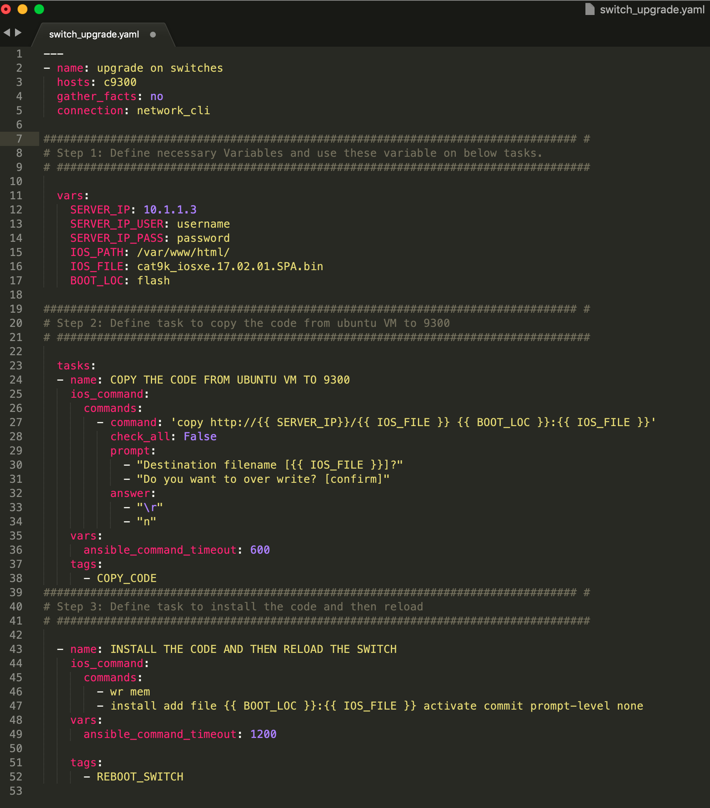

Now run the playbook on the ubuntu server and the whole process will
take around 20 minutes for copying the file from ubuntu to the switch
and then execute upgrade on the switch.

## Conclusion

This module has shown how to start with ansible and create different
playbooks for configuring Access lists, VRFs and how to use NETCONF
module to configure the switch using XML code. Also shown a playbook for
executing an upgrade on the switch.
